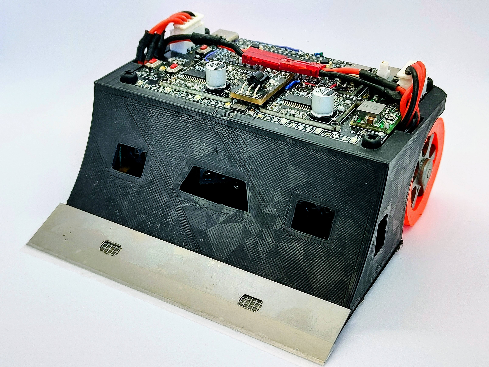
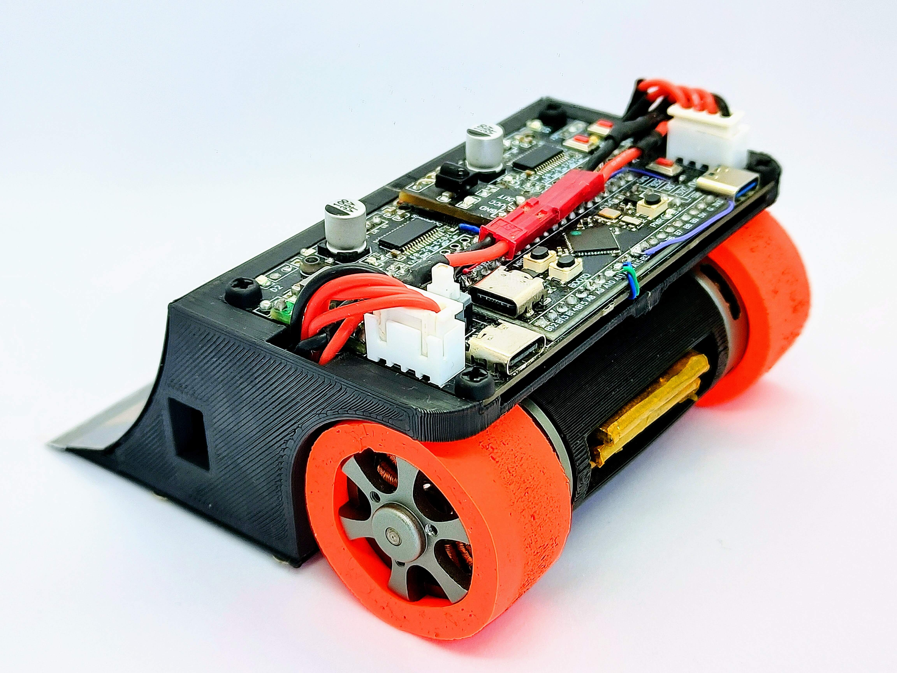
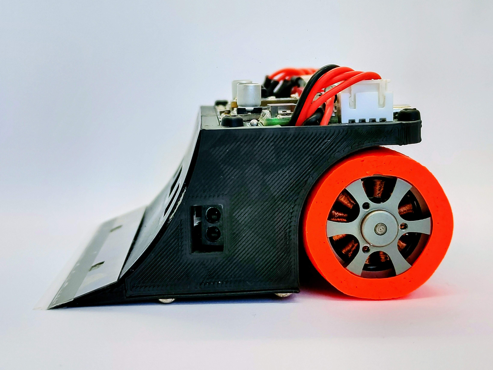

# UltiBot

Robot de Minisumo con 6 sensores SHARP GP2Y0E03


<table>
<tr>
<td  colspan="2">  </td>
</tr>
<tr>
<td>  </td>
<td>  </td>
</tr>
</table>


## Hardware
- STM32F401CCU6 (Principal) Y STM32F103C8T6 (FOC)
- 2x SimleFOCMini
- 2x Motores gimbal 12v 80T
- 2xLiPo 3S ~180 mAh
- 6x Sensores SHARP GP2Y0E03
- 2x Sensores QRE1113
- Ruedas JSUMO JS2622
- Chasis impreso en PLA


## Software
- Programado con VSCode y PlatformIO
- Disponible programa con estrategias básicas


## KiCAD

### PCB UltiBot v1.0


### Librerías

Las librerías necesarias para este proyecto se encuentran en [OPRobots/KiCADLibraries](https://github.com/OPRobots/KiCADLibraries)

La estructura tiene que quedar de la siguiente forma:

```bash
└── kicad_project
    └── custom_libraries
        ├── custom_footprints
        │   ├── *.kicad_mod
        │   └── ...
        └── custom_symbols.kicad_sym
```