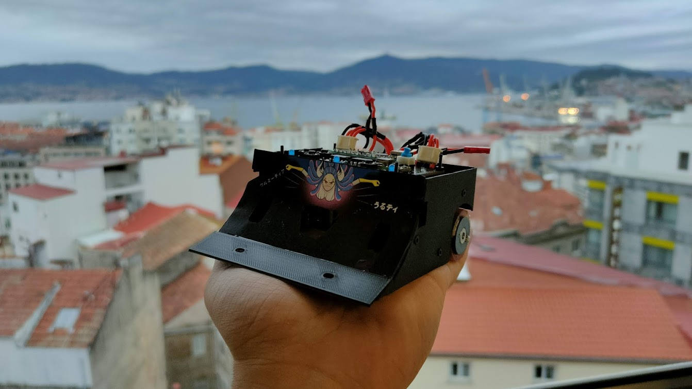
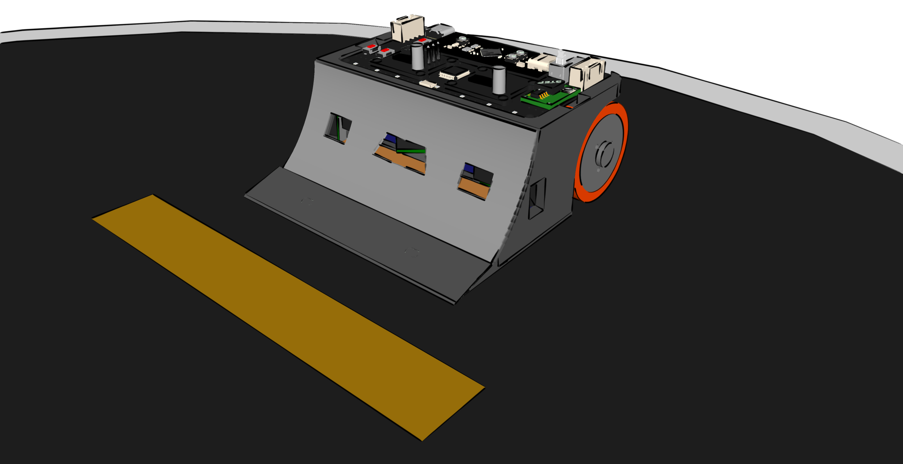
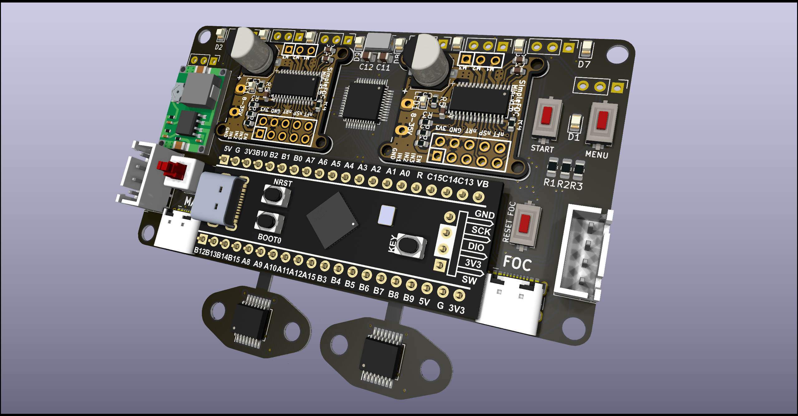
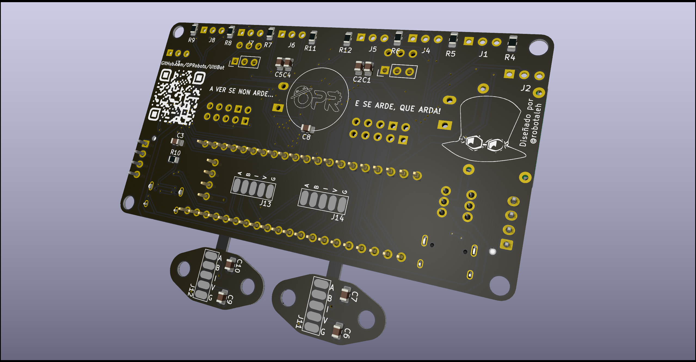

# UltiBot

Robot de Minisumo con 6 sensores SHARP GP2Y0E03



## Hardware
- Arduino Nano / STM32F401CCU6
- Driver de motores TA6586
- 2x Motores "estilo Fingertech Silverspark" de reductora desconocida
- 2xLiPo 3S ~180 mAh
- 6x Sensores SHARP GP2Y0E03
- 2x Sensores QRE1113
- Goma de ruedas hecha a medida con Uretano/Vitaflex20
- Chasis impreso en PLA con recubrimiento de láminas de ABS texturizado
- Ilustración del personaje Ulti de OnePiece que da nombre al robot en la rampa frontal


## Software
- Programado con VSCode y PlatformIO
- Disponible programa con estrategias básicas


## KiCAD

### PCB UltiBot v1.0



### Librerías

Las librerías necesarias para este proyecto se encuentran en [OPRobots/KiCADLibraries](https://github.com/OPRobots/KiCADLibraries)

La estructura tiene que quedar de la siguiente forma:

```bash
└── kicad_project
    └── custom_libraries
        ├── custom_footprints
        │   ├── *.kicad_mod
        │   └── ...
        └── custom_symbols.kicad_sym
```